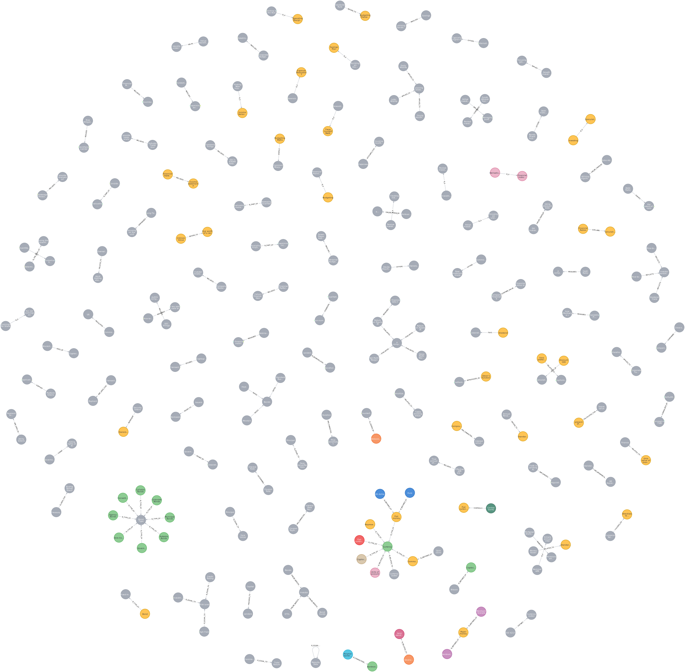

# FinCatch Coding Task (medium)

The task was to implement 3 parts, an extractor, a relationship vizualizer and a clustering module. 

## Dependencies
### Install redis
You'll need `redis` setup to run a celery queue (which we use for the extractor to optimize the process).
Checkout [redis installation guide](https://redis.io/docs/install/install-redis/)

### Install poetry

Before installing `poetry`, you'll most likely want to install `pipx`.

```bash
brew install pipx
pipx ensurepath
```

Then install `poetry` using `pipx`.

```bash
pipx install poetry
```

With `poetry` installed you can use it to install the dependencies in your chosen virtual environment.

```bash
poetry install
```

### Setup ENVs

You will also need to setup the `.env` file. You can copy the `.env.example` file to `.env` and fill in the required values. 

```bash
cp .env.example .env
```

### Setup Database
You will also need to setup a local database of your choice. I personally use `postgresql` but you can use `sqlite` as well.


### Setup neo4j
You will also need to setup `neo4j` to run the relationship visualizer. You can follow the [neo4j installation guide](https://neo4j.com/docs/operations-manual/current/installation/)

## Q1: Extractor
The major ask for the extractor was for it to be scaleable. I decided to use celery to queue the task of extracting the data from the given URL, generating the AI summary and storing the data in the database.

### Running the Extractor
To run the extractor, you can run the following commands in your terminal (at the root of the project).

```bash
redis-server
``` 
to start the redis server.

```bash
poetry run celery -A fc_task.runner worker -l INFO
```
to start the celery worker.

After doing the above two steps, ensure that the `data_source` directory contains the CSV(s) that you want to extract data from. Then run the following command to start the extractor.

```bash
poetry run python -m fc_task.extractor.main   
```

### Extractor Design
The extractor is designed to be scaleable. It uses celery to queue the task of extracting the data from the given URL, which means we can easily spawn multiple workers to scale the process / process in parallel.

The extractor is also designed to be fault tolerant. I purposely used the OPENAI library to generate the AI summary because it is a paid service and I wanted to show how we can handle exceptions and retry the task if it fails.

## Q2: Relationship Visualizer
For the relationshiip visualizer, due to the constraints of budget I used a local Llama model instead of OpenAI.
- I recommend installing it and running it via Ollama. 
You can find the instructions [here](https://ollama.com/) and use the `llama3.2` model.
  - Once installed (assuming you are using a mac), you can run the following command to start the model:
  ```ollama run llama3.2```
  - Please verify that the model is running on port 11434 (you can check this by going to http://localhost:11434 and you should see the message "Ollama is running").
    If it is running on a different port, you will need to create a .env file (you can just duplicate the `.env.example` file and rename it to `.env`) in the root of the project and add/modify line:
    ```OLLAMA_URL=http://localhost:<port>```

### Running the Relationship Visualizer
To run the relationship visualizer, you can run the following command in your terminal (at the root of the project).

```bash
poetry run python -m fc_task.vizualizer.relation_extraction
```

You can then run the following command in your neo4j browser to see the relationships:
```cypher
MATCH (n) MATCH ()-[r]->() RETURN n, r
```

To save you the time, here is a screenshot of the relationships in the neo4j browser:
